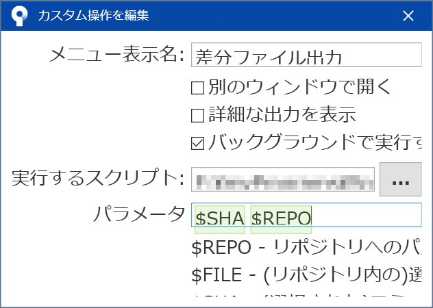
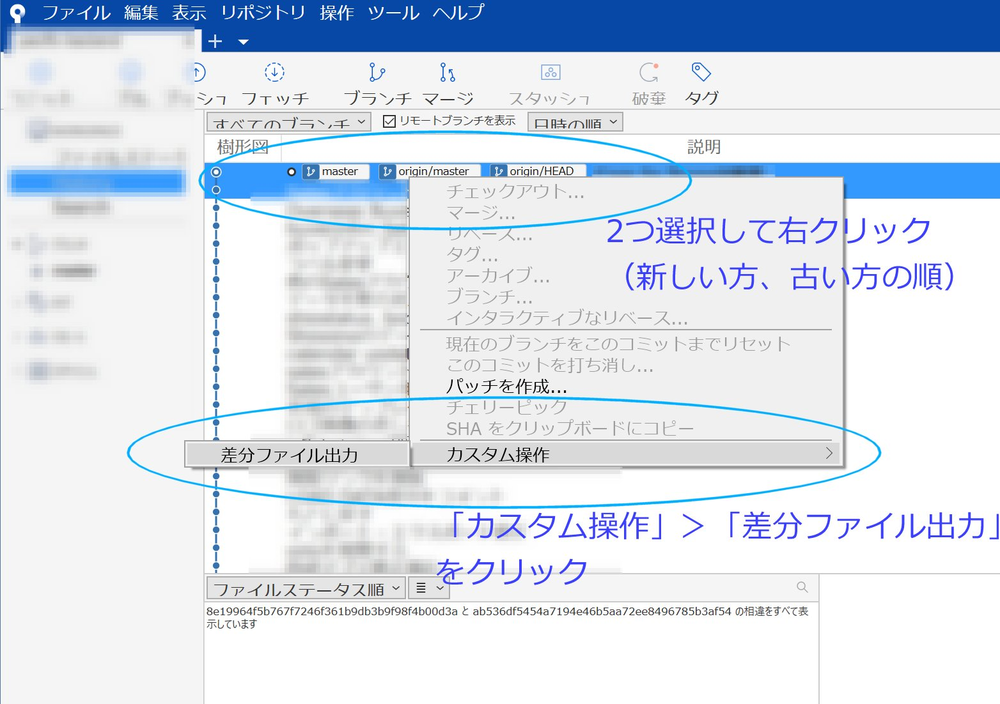

# SourceTree用のカスタム操作コマンド

いずれもSourceTree用のカスタム操作コマンドファイルです。DOSプロンプト形式で記述していますので、Windows専用です。

## インストール方法

1. SourceTreeの[ツール]-[オプション]を開く。

2. [カスタム操作]タブを開き、「追加」ボタンをクリック

3. 「メニュー表示名」にコマンド名、実行するスクリプトにコマンドファイル名、パラメータに`$SHA $REPO`を入力

   

## 各コマンドの説明

### 1. 差分ファイルzip

Gitのコミット間差分ファイルをzipで出力します。

差分出力したいコミットを2つ選び、右クリックして「カスタム操作」を実行します。

※要zipコマンド（GnuWin等）

### 2. 差分ファイル出力

「差分ファイルzip」と基本的には同じですが、*.diff を一緒に出力します。

※要zip、unzipコマンド（GnuWin等）